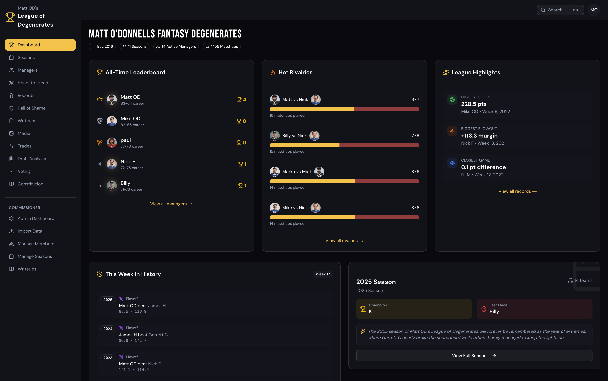

# FantasyMax

**The historical and social layer for your fantasy football league.**

FantasyMax sits alongside Yahoo and ESPN to give your league what those platforms don't: a decade of history, head-to-head rivalry tracking, commissioner writeups, media uploads, a hall of shame, and a living constitution. It's built for leagues that have been running for years and want a home for the stories behind the stats.



[Live Site](https://fantasymax.vercel.app)

---

## Features

- **10+ years of historical stats** — season-by-season records, standings, and matchup results imported from Yahoo or CSV
- **Head-to-head rivalry tracker** — lifetime records between every pair of managers with win streaks and point differentials
- **Manager dashboards** — personal pages with career stats, awards, and trade history
- **AI-powered recaps** — commissioner writeups and season reviews generated with Claude
- **Media gallery** — photo and video uploads from draft days, Vegas trips, and league events
- **League voting** — polls and votes for awards, rule changes, and disputes
- **Constitution** — living rules document with amendment history
- **Hall of Shame** — last-place finishers immortalized forever
- **Draft analyzer** — historical draft performance breakdowns
- **2026 War Room** — evidence-led offseason signals interpreted through league-specific roster and scoring settings
- **Trade history** — full trade log with context and commentary
- **Invite-only access** — password-gated, members-only experience

## Tech Stack

| Technology | Role |
|---|---|
| Next.js 16 | App Router, React Server Components |
| TypeScript | Strict mode throughout |
| Supabase | PostgreSQL database, auth, row-level security, file storage |
| Tailwind CSS v4 | Styling |
| shadcn/ui | Component library |
| Anthropic Claude | AI-generated recaps and season reviews |
| Zod | Runtime validation for all inputs and imports |
| Vitest | Unit and integration testing |

## Getting Started

```bash
# Clone
git clone https://github.com/matthewod11-stack/FantasyMax.git
cd FantasyMax

# Install dependencies
npm install

# Set up environment variables
cp .env.local.example .env.local
# Fill in your Supabase and Yahoo API credentials

# Run locally
npm run dev
```

Open [http://localhost:3004](http://localhost:3004) to view the app.

## Architecture

FantasyMax uses a **dual import system** — data can come from the Yahoo Fantasy API or CSV files, both normalizing to the same schema. Historical data is pre-loaded by the commissioner before members are invited.

Key design decisions:
- **Materialized views** for pre-calculated head-to-head records
- **Row-level security** on all tables via Supabase RLS
- **Server components by default**, client components only where interactivity requires it
- **Members vs. Teams** — members are real people that persist across seasons; teams are season-specific

## License

[MIT](LICENSE)
